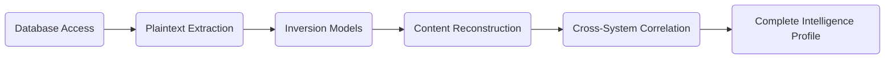
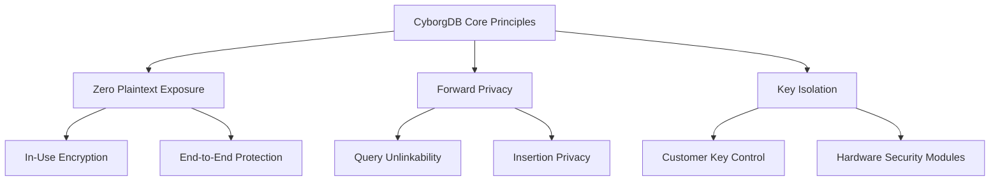

CyborgDB is designed to address one of the most urgent and overlooked risks in enterprise AI: **centralized AI data becoming a single, high-value breach target**.

As enterprises adopt AI applications—especially those using Retrieval-Augmented Generation (RAG) and other data-intensive approaches—they centralize data from multiple systems (Finance, HR, CRM, Email, Documents) into a single vector database. While this boosts AI performance, it also creates a **single point of failure** with unprecedented blast radius potential.

<Tip>
A well-scoped threat model is essential to evaluate whether CyborgDB's security properties align with your risk profile. This page should be read alongside our detailed [Encryption](./encryption) and [Threat Model](./threat-model) sections.
</Tip>

## 1. The Centralized Intelligence Risk

Before AI adoption, sensitive enterprise data was naturally segmented across multiple systems, each with independent security perimeters. AI fundamentally changes this landscape by requiring data centralization for optimal performance.

<Frame>
    
</Frame>

This architectural shift creates a **concentration risk**: instead of requiring separate breaches of multiple systems, attackers need only compromise one vector database to access intelligence from across the entire organization.

### Vector Database Vulnerability Profile

Standard vector databases exacerbate this risk through fundamental design choices:

<CardGroup cols={3}>
  <Card title="Plaintext Storage" icon="lock-open">
    Embeddings stored without encryption, immediately exploitable upon access
  </Card>
  <Card title="Dense Information" icon="brain">
    Each vector encodes rich semantic content from source documents
  </Card>
  <Card title="ML-Optimized Format" icon="microchip">
    Vector format specifically vulnerable to machine learning exploitation
  </Card>
</CardGroup>

## 2. Attack Mechanics

When attackers compromise a traditional vector database, they can execute a systematic intelligence extraction process:

**Attack timeline on standard vector DB:**
1. **Initial access** (minutes): Exploit application vulnerabilities or cloud misconfigurations
2. **Data extraction** (minutes): Download plaintext embeddings and metadata  
3. **Inversion setup** (hours): Deploy transformer models or gradient optimization
4. **Content recovery** (hours to days): Reconstruct original documents with 80-99% fidelity
5. **Intelligence synthesis** (days): Correlate recovered data across enterprise systems

<Warning>
Cyborg [demonstrated this complete attack chain](./threat-model#4-attack-demonstration) at the Confidential Computing Summit (June 2025), achieving 99.38% content reconstruction in under 5 minutes on a production-like database.
</Warning>

### Amplified Impact

Vector database breaches differ qualitatively from traditional data breaches:

| Traditional DB Breach | Vector DB Breach | Impact Multiplier |
|----------------------|------------------|-------------------|
| Single application data | Multi-system intelligence | **10-100x** |
| Structured data theft | Semantic relationship exposure | **Qualitative difference** |
| Point-in-time snapshot | Historical relationship mapping | **Temporal amplification** |

## 3. CyborgDB Security Architecture

CyborgDB disrupts the attack chain through a **defense-in-depth** approach that renders vector database breaches non-exploitable.

This security is achieved through several key mechanisms:

- **In-use encryption**: Embeddings remain encrypted even during computation
- **Query unlinkability**: Current searches cannot be correlated with historical patterns
- **Insertion obfuscation**: New data additions reveal no information about existing content
- **Temporal isolation**: Past compromises do not affect future security
- **Customer key control**: Encryption keys remain under customer management
- **Zero-knowledge operation**: CyborgDB operates without access to decryption keys

<Tip>To learn more about how CyborgDB implements these protections, read our [Encryption guide](./encryption).</Tip>

## 4. Security Guarantees

CyborgDB provides mathematically provable protections against the threat scenarios in our [threat model](./threat-model).

| Attack Vector | Standard Vector DB | CyborgDB Protection | Security Guarantee |
|---------------|-------------------|---------------------|-------------------|
| **Embedding extraction** | ❌ Immediate plaintext access | ✅ AES-256-GCM encrypted storage | Computational security (2^256 operations) |
| **Memory scraping** | ❌ Plaintext in RAM | ✅ In-use encryption | Semantic security preservation |
| **Inversion attacks** | ❌ Direct ML exploitation | ✅ Ciphertext-only exposure | Information-theoretic privacy |
| **Query correlation** | ❌ Full access pattern visibility | ✅ Forward-private indexing | Unlinkability guarantee |
| **Cross-system linking** | ❌ Trivial metadata correlation | ✅ Per-record key isolation | Computational indistinguishability |

## 5. Getting Started

CyborgDB makes securing your AI database as straightforward as deploying it:

<Steps>
    <Step title="Risk Assessment" icon="clipboard-list">
        Evaluate your current vector database security posture and compliance requirements
    </Step>
    <Step title="Try CyborgDB" icon="bolt">
        [Get started in 5 minutes](./quickstart) to evaluate security and performance
    </Step>
    <Step title="Launch to Production" icon="rocket">
        Migrate production workloads with full cryptographic protection
    </Step>
</Steps>

By protecting data across its full lifecycle and designing for zero-plaintext exposure, CyborgDB ensures that you can innovate with AI without creating a breach magnet for your organization's most valuable intelligence.

## 6. Further Reading

<CardGroup cols={2}>
    <Card title="Threat Model" href="./threat-model" icon="bomb">
        Detailed adversary analysis and attack scenarios
    </Card>
    <Card title="Encryption" href="./encryption" icon="lock">
        Technical implementation of cryptographic protections
    </Card>
</CardGroup>