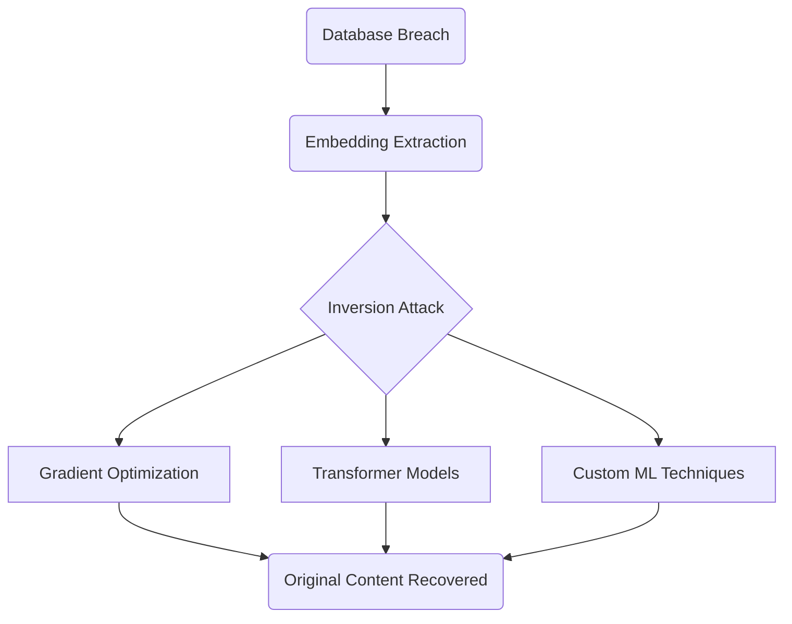
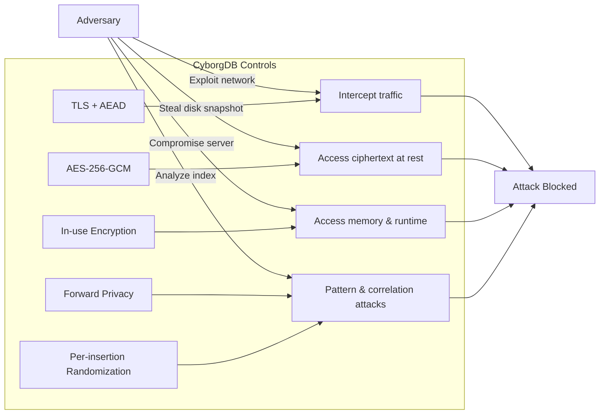

CyborgDB's threat model defines the types of adversaries we assume, the attacks we protect against, and the attacks we explicitly do not address. It guides the design of our encryption, key management, and system architecture.

<Tip>
A well-scoped threat model is essential to evaluate whether CyborgDB's security properties align with your risk profile. This page should be read alongside the [Encryption](./encryption) section.
</Tip>

## 1. Adversary Model

We assume adversaries can be:

<CardGroup cols={2}>
  <Card title="External Network Adversary" icon="globe">
    Can intercept, modify, or replay traffic between client and server.
  </Card>
  <Card title="Server-Side Adversary" icon="server">
    Has full read access to server memory, storage, and code execution environment.
  </Card>
  <Card title="Insider Threat" icon="user">
    A privileged operator or cloud provider administrator with direct infrastructure access.
  </Card>
  <Card title="Passive Data Analyst" icon="chart-scatter">
    Can analyze access patterns, ciphertexts, and index structures over time.
  </Card>
</CardGroup>

We do **not** assume the client endpoint is compromised (see [Out of Scope](#6-out-of-scope)), nor do we defend against malicious users with valid credentials performing authorized actions.

## 2. Attack Surfaces

Vector databases present a uniquely dangerous attack surface because they **centralize semantic intelligence** from across an organization's entire data ecosystem. Unlike traditional databases that contain data from a single application, vector databases aggregate embeddings from CRM systems, HR databases, financial records, email communications, and document repositories.

Standard vector databases compound this risk by storing & using embeddings in **plaintext format**, making them immediately exploitable upon breach. Once an attacker gains access, they can directly extract dense vector representations and apply machine learning techniques to reconstruct the original sensitive content with high fidelity.

This combination of centralized intelligence and plaintext storage transforms what should be isolated system breaches into organization-wide intelligence compromises. The following attack surfaces become particularly critical in this context:

<Steps>
    <Step title="Data at Rest" icon="database">
        - Disk-level theft of database files
        - Cloud snapshot compromise
        - Backup leakage
    </Step>
    <Step title="Data in Transit" icon="network-wired">
        - Man-in-the-middle interception
        - Traffic replay or modification
    </Step>
    <Step title="Data in Use" icon="microchip">
        - Memory scraping from compromised server
        - Runtime introspection of index structures
        - Retrieval of embeddings or keys from process space
    </Step>
    <Step title="Index & Query Metadata" icon="magnifying-glass">
        - Frequency analysis of search tokens
        - Correlation between inserted embeddings and prior queries
        - Leakage via predictable index structures
    </Step>
</Steps>

## 3. Adversary Capabilities

| Capability | Example Sources |
|------------|-----------------|
| **Full disk access** | Stolen storage volume, cloud snapshot |
| **Full memory access** | Compromised hypervisor, malicious kernel module |
| **Network interception** | BGP hijack, malicious ISP |
| **Log & telemetry access** | Misconfigured logging, compromised SIEM |
| **Code execution on server** | Supply chain attack, RCE in application stack |

The **Server-Side Adversary** case — full memory, disk, and runtime access — is the primary driver for CyborgDB's *in-use encryption* and *forward-secure index* design.

## 4. Attack Demonstration

Cyborg demonstrated the severity of vector database vulnerabilities at the Confidential Computing Summit (June 2025):

- **Target**: Production-like vector DB with synthetic sensitive data (e.g., social security numbers, medical info)
- **Attack time**: < 5 minutes from access to sensitive data recovery  
- **Recovery rate**: 99.38% successful reconstruction of original documents

<iframe 
    className="w-full aspect-video rounded-xl"
    src="https://www.youtube.com/embed/TK2L3P3k-EM?si=Xj_fKUo_gwtWHkjL&amp;start=270" 
    title="YouTube video player" 
    allow="accelerometer; autoplay; clipboard-write; encrypted-media; gyroscope; picture-in-picture; web-share"
    referrerpolicy="strict-origin-when-cross-origin"
    allowfullscreen>
    Your browser does not support iframes. 
    <a href="https://www.youtube.com/watch?v=TK2L3P3k-EM&t=270s" target="_blank" rel="noopener noreferrer">
        Watch the attack demo on YouTube
    </a>
</iframe>

### Attack Flow

## 5. Mitigation Mapping

The table below maps specific adversary actions to CyborgDB controls:

| Attack Vector | Mitigation | Residual Risk |
|---------------|------------|---------------|
| **Disk theft** | AES-256-GCM encryption at rest | Key theft from KMS would bypass |
| **Memory scraping** | In-use encryption with ephemeral node keys | Queries in progress may suggest active clusters |
| **Index structure analysis** | Forward privacy & per-insertion randomization | Search pattern leakage still possible within active session |
| **Embedding inversion** | Encrypted embeddings never stored/processed in plaintext | Compromised client could still expose |
| **Network interception** | TLS + AEAD | Endpoint compromise would still allow decryption |
| **Query correlation** | Forward-secure cryptographic counters | Statistical attacks on *large* query volumes |
| **Cross-system linking** | Per-record key derivation with unique IVs | Metadata correlation if encryption keys compromised |

<Info>
These controls assume standard cryptographic primitives — AES-256, SHA-3, HMAC — remain unbroken and that all encryption keys remain secret. If either assumption fails, the corresponding protections may no longer hold.
</Info>

### Control Points in the Attack Chain

<Tip>To learn more about how CyborgDB implements these protections, read our [Encryption guide](./encryption).</Tip>

## 6. Out of Scope

CyborgDB **does not** protect against:

- **Client endpoint compromise**: If the user's device is compromised, plaintext data may be exposed during normal operation
- **Authorized insider misuse**: Valid users performing authorized but malicious actions within their permissions
- **Social engineering**: Attacks targeting users to reveal credentials or perform unauthorized actions
- **Physical access to client devices**: Direct access to unlocked client machines
- **Key escrow attacks**: Government or legal compulsion to provide decryption keys (mitigated by BYOK/HYOK)

<Warning>
Organizations should implement complementary controls (endpoint protection, user training, access controls) to address these out-of-scope threat vectors.
</Warning> 