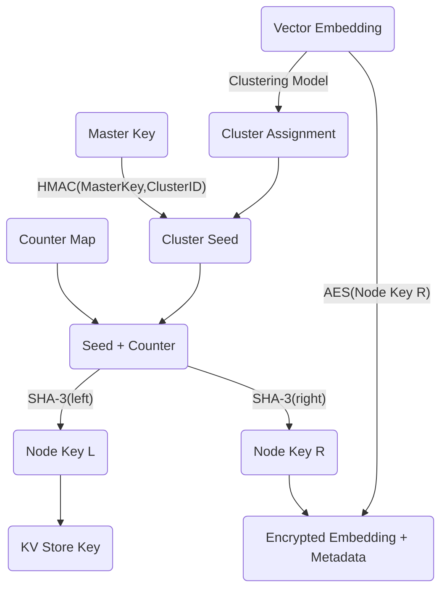
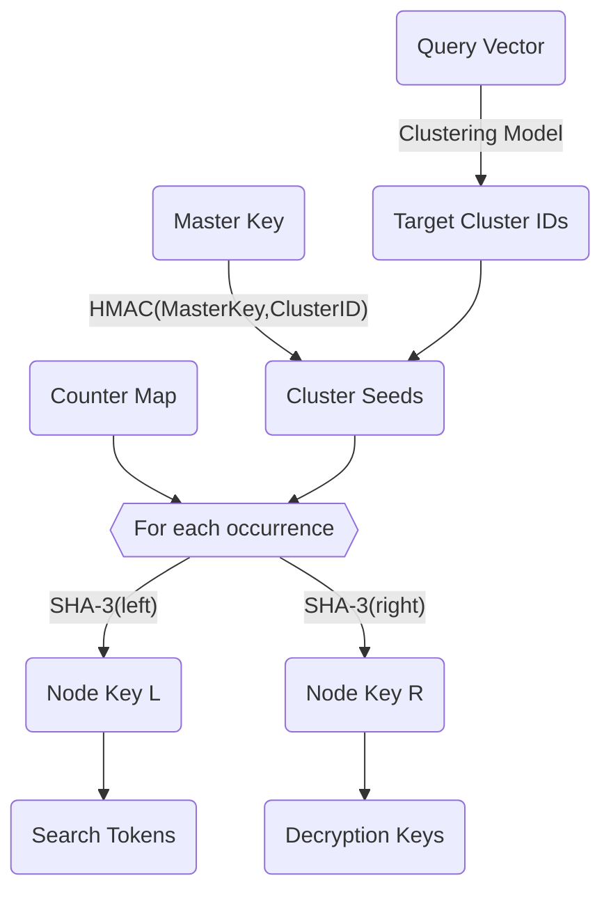
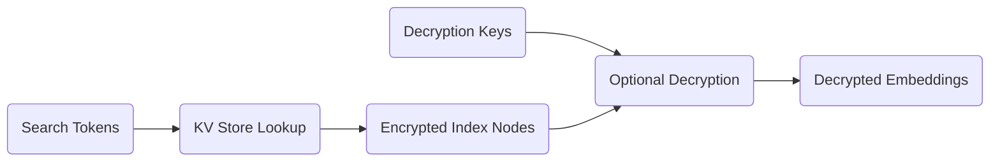

CyborgDB encrypts **all sensitive data** — including embeddings, document IDs, contents, and metadata — **end-to-end**, ensuring that nothing is stored or processed in plaintext without authorization. This section details the cryptographic design, the indexing scheme, and how forward privacy is achieved.

<Check>The technology discussed in this guide is covered by Cyborg's IP portfolio, including US Patents [12,164,664](https://patents.google.com/patent/US12164664), [11,860,875](https://patents.google.com/patent/US11860875), [11,423,028](https://patents.google.com/patent/US11423028) and [10,977,315](https://patents.google.com/patent/US10977315), among others. Any use is subject to licensing agreements.</Check>

## 1. Data Encryption

All stored records in CyborgDB are encrypted using:

- <Tooltip tip="A symmetric encryption algorithm with a 256-bit key size, considered secure against brute-force attacks">AES-256</Tooltip> in <Tooltip tip="Galois/Counter Mode — a block cipher mode that provides both confidentiality and integrity (authenticated encryption)">GCM mode</Tooltip>
- Per-record unique <Tooltip tip="Initialization Vectors — random values used to ensure distinct ciphertexts for identical plaintexts.">IVs</Tooltip> to prevent ciphertext pattern reuse
- Authenticated encryption, ensuring both confidentiality and tamper detection

This symmetric encryption is applied to:

<CardGroup cols={2}>
  <Card title="Vector Embeddings" icon="code" />
  <Card title="Document IDs" icon="hashtag" />
  <Card title="Document Contents" icon="book" />
  <Card title="Metadata Fields" icon="bookmark" />
</CardGroup>

This guarantees that even with full disk access, data remains encrypted and cannot be modified undetected.

## 2. Forward-Secure Cryptographic Indexing 

CyborgDB also encrypts the **search index** used for approximate nearest neighbor (ANN) retrieval. The index is constructed using a **forward-secure** cryptographic scheme inspired by research in forward-private searchable encryption, combined with Cyborg's patented enhancements.

<Info>
Forward privacy ensures that newly inserted entries cannot be linked to prior search queries, even if the index is compromised later.
</Info>

### Key Concepts

1. **Per-cluster seeds via HMAC**  
   Each ANN cluster is assigned a unique seed derived from the master key using <Tooltip tip="A keyed-hash message authentication code — provides both message integrity and authentication.">HMAC</Tooltip>(MasterKey, ClusterID).

2. **Binary tree indexing with SHA-3**  
   The ANN cluster is represented as a binary tree. Internal node keys are derived from their children using <Tooltip tip="A cryptographic hash function standardized by NIST">SHA-3</Tooltip>.

3. **Token-scoped search**  
   Search queries produce tokens that only target the minimal set of node keys required to execute the query. Unnecessary index nodes are ignored.

4. **In-use encryption**  
   Queries are executed over ciphertext nodes, preventing leakage from memory.

### Cryptographic Vector Indexing Flow

Below is an overview of how CyborgDB indexes vectors cryptographically:

This flow demonstrates how CyborgDB transforms a single vector embedding into multiple encrypted components:

1. **Vector clustering**: The clustering model assigns each embedding to an optimal cluster for efficient ANN search
2. **Deterministic key derivation**: The master key and cluster ID generate a unique seed for this cluster
3. **Forward privacy**: The counter map ensures identical embeddings get different cryptographic treatment on each insertion
4. **Dual-purpose keys**: SHA-3 produces two keys serving different functions - one for storage indexing, one for encryption
5. **Secure storage**: The final encrypted embedding can only be decrypted with the derived Node Key R

This design ensures that even identical vector embeddings result in different ciphertexts and index entries, preventing correlation attacks across insertions.

## 3. Cryptographic Approximate Nearest Neighbor Search

CyborgDB's search execution maintains cryptographic protection throughout the entire query process, leveraging the cryptographic index discussed [above](#2-forward-secure-cryptographic-indexing).

### Token Generation

When a client initiates a query:

1. **Query vector preparation**: The search vector undergoes the same clustering model to determine target clusters
2. **Search token derivation**: For each target cluster, the client recreates the cryptographic key hierarchy
3. **Minimal key generation**: Only the node keys required for the query path are computed

This process generates the exact same keys used during indexing, but only for the clusters relevant to the query. The client now possesses the minimal set of tokens needed to decrypt the required index nodes.

<Info>
This token-scoped approach ensures that irrelevant index nodes remain opaque ciphertexts, minimizing information leakage.
</Info>

### Encrypted Index Traversal

With search tokens in hand, the server executes the query while maintaining cryptographic protection:

The retrieval and decryption process:

1. **Token-based retrieval**: Search tokens are used as lookup keys in the encrypted KV store
2. **Optional decryption**: Embeddings can be decrypted for final distance computation

This ensures that the server can execute efficient ANN search while never having persistent access to plaintext embeddings or the ability to decrypt irrelevant index nodes.

Alternatively, node decryption can happen client-side, ensuring the server only deals with ciphertext and never sees plaintext embeddings. 

## 4. Security Benefits

CyborgDB's multi-layered cryptographic design provides comprehensive protection against various threat scenarios, leveraging Cyborg's patented technology to achieve security properties impossible with traditional approaches.

### Threat Protection Matrix

| Threat Scenario          | Protection Mechanism                                                             |
| ------------------------ | -------------------------------------------------------------------------------- |
| **Disk theft**           | AES-256-GCM encryption at rest                                                   |
| **Network interception** | TLS + AEAD encryption in transit                                                 |
| **Server compromise**    | In-use encryption prevents extraction of plaintext embeddings or node keys       |
| **Index leakage**        | Forward privacy hides relationship between new inserts and past searches         |
| **Embedding inversion**  | Ciphertext embeddings are never exposed — inversion is not possible without keys |

### Security Properties

| Property | Implementation | Benefit |
|----------|----------------|---------|
| **Query Privacy** | Token-scoped key derivation | Server never sees full index keys |
| **Result Confidentiality** | End-to-end encryption | Plaintext results never leave client |
| **Forward Security** | Counter-based key evolution | Past compromises don't affect future queries |
| **Index Obfuscation** | Ciphertext-only storage | Unused index nodes remain opaque |
| **Correlation Resistance** | Per-insertion randomization | Identical vectors produce different ciphertexts |

<Check>
Traditional encrypted search schemes are vulnerable to statistical attacks. CyborgDB's forward-secure design prevents these correlation attacks.
</Check>

## 5. Performance

While comprehensive cryptographic protection typically comes with significant overhead, CyborgDB's implementation has been **extensively optimized** to achieve production-grade performance that rivals plaintext systems.

### Performance Optimizations

CyborgDB achieves exceptional performance through several key optimizations:

- **Hardware acceleration**: Leveraging AES-NI and SHA extensions available in modern processors
- **Parallel key derivation**: Computing node keys concurrently across multiple clusters  
- **Lazy decryption**: Only decrypting index nodes when accessed during search traversal
- **Vectorized operations**: Batch processing of similarity computations in encrypted space
- **Cache-optimized layouts**: Organizing encrypted index structures for optimal memory access patterns

These optimizations deliver industry-leading performance:

> **>10,000 QPS** at **95% recall** for ANN search over encrypted embeddings 
>
> **Sub-10ms query latency** for typical workloads