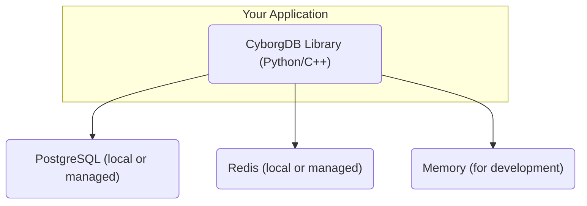

CyborgDB Embedded provides native libraries for Python and C++, enabling you to integrate confidential vector search directly into your applications. This deployment model gives you maximum control, performance, and security by running entirely within your infrastructure.

## Why Choose CyborgDB Embedded?

**Maximum Security**  
Your data never leaves your environment. Vector embeddings remain encrypted on your hardware with keys under your complete control.

**Ultimate Performance**  
Direct integration eliminates network overhead and serialization costs. Take advantage of local CPU/GPU resources and custom optimizations.

**Full Control**  
Configure every aspect of the system - from index parameters to memory management. Perfect for custom requirements and specialized deployments.

**Any Environment**  
Deploy in air-gapped networks, edge devices, or custom infrastructure where external APIs aren't suitable.

---

## Quick Start

<CardGroup cols={1}>
  <Card title="Embedded Quickstart" href="/versions/v0.13.x/embedded/guides/intro/quickstart" icon="rocket">
    *Get running in 5 minutes with Python or C++*

    Step-by-step guide covering both Python and C++ embedded library setup and usage.
  </Card>
</CardGroup>

<Note>
**Free API Key Users**: If you're using a free API key, CyborgDB Embedded will be limited to 1,000,000 items per index.

Upgrade to a [paid plan](https://www.cyborg.co/pricing) to remove this limitation.
</Note>

--- 

## Architecture Overview

CyborgDB Embedded integrates directly into your application process:

**Key Benefits:**
- No external API dependencies
- Sub-millisecond query latency potential
- Complete data sovereignty
- Custom integration possibilities

---

## When to Use Embedded vs Service

<Tabs>
  <Tab title="Choose CyborgDB Embedded">
    - **Data must stay on-premises** - Regulatory or security requirements
    - **Ultra-low latency needed** - Sub-millisecond response requirements  
    - **Custom integration required** - Unique workflow or system requirements
    - **Cost optimization critical** - High-volume usage with cost sensitivity
    - **Air-gapped deployment** - No external network access available
    - **Single application focus** - One primary application using vector search
  </Tab>
  
  <Tab title="Consider CyborgDB Service">
    - **Multi-language teams** - Need SDKs in multiple languages
    - **Microservice architecture** - Want to separate vector operations from application logic
    - **Operational simplicity** - Prefer service-based deployment patterns
    - **Independent scaling** - Need to scale vector operations separately
    - **Team collaboration** - Multiple teams need access to the same vector data
  </Tab>
</Tabs>

## Next Steps

<CardGroup cols={3}>
  <Card title="Start Building" href="/versions/v0.13.x/embedded/guides/intro/quickstart" icon="rocket">
    *Get hands-on with the quickstart guide*

    Follow our comprehensive guide covering both Python and C++ setup
  </Card>
  <Card title="Browse Capabilities" href="../encrypted-indexes/introduction" icon="code">
    *Explore detailed integration examples*

    Learn about encrypted index operations and data management
  </Card>
  <Card title="Framework Integration" href="../../../integrations/langchain/introduction" icon="plug">
    *LangChain and other integrations*

    Drop-in replacement for existing vector stores
  </Card>
</CardGroup>

Ready to build confidential AI applications with complete control? Start with our [Embedded Quickstart](/versions/v0.13.x/embedded/guides/intro/quickstart) guide!