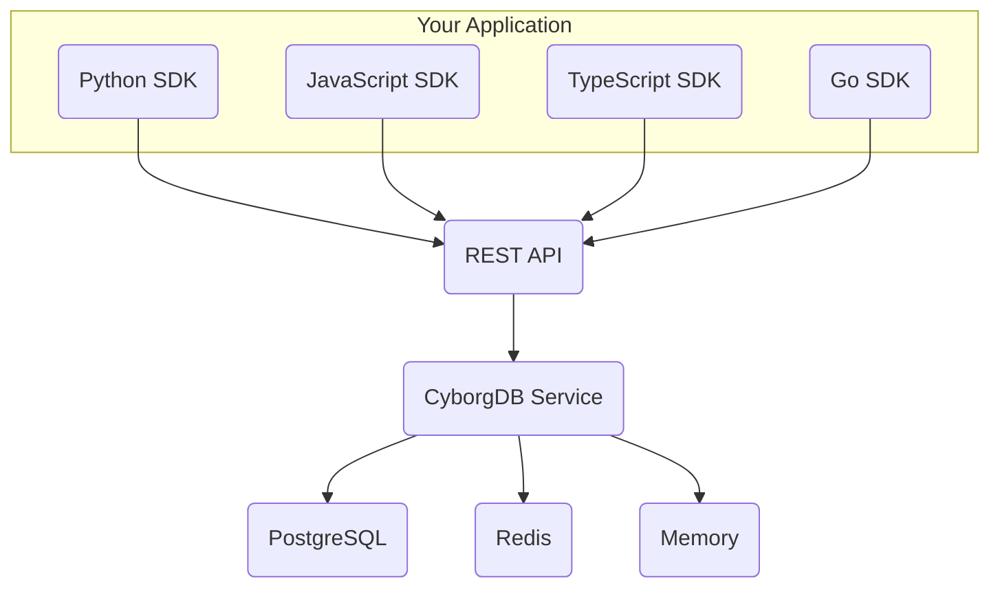

CyborgDB Service provides a self-hosted microservice deployment with REST API and client SDKs. This model offers the perfect balance between control and convenience - you maintain ownership of your infrastructure while enjoying the benefits of a service-oriented architecture.

## Why Choose CyborgDB Service?

**Faster Development**  
REST API and multi-language SDKs accelerate development across different teams and technology stacks.

**Built for Scale**  
Designed for high-throughput production workloads with horizontal scaling capabilities and connection pooling.

**DevOps Friendly**  
Docker-based deployment with comprehensive monitoring, logging, and operational tooling built-in.

**Multi-Language Support**  
Native SDKs for Python, JavaScript/TypeScript, Go, and C++ - use your preferred language stack.

---

## Deployment Options

<CardGroup cols={2}>
  <Card title="Docker Deployment" href="./quickstart-docker" icon="docker">
    *Containerized service deployment*
    
    - Self-contained Docker image
    - Easy Kubernetes integration
    - Production-ready configuration
    - Automatic dependency management
    - Best for: Production deployments, containerized environments
  </Card>
  
  <Card title="Python Service" href="./quickstart-python" icon="python">
    *Direct Python installation*
    
    - Pip-installable service package
    - Custom Python environment control
    - Lightweight alternative to Docker
    - Direct dependency management
    - Best for: Python-centric environments, development
  </Card>
</CardGroup>

---

## Client SDKs

Access CyborgDB Service from any language using our comprehensive SDK collection:

<CardGroup cols={3}>
  <Card title="Python SDK" href="../../python-sdk/introduction" icon="python">
    *Full-featured Python client*
    
    Complete client with async support and type hints
  </Card>
  
  <Card title="JavaScript/TypeScript SDK" href="../../js-ts-sdk/introduction" icon="js">
    *Modern web and Node.js client*
    
    Promise-based API with TypeScript definitions
  </Card>

  <Card title="Go SDK" href="../../go-sdk/introduction" icon="golang">
    *Native Go client*
    
    Efficient and idiomatic Go API for CyborgDB
  </Card>
</CardGroup>

---

## Quick Start Paths

<CardGroup cols={2}>
  <Card title="Docker Quickstart" href="./quickstart-docker" icon="docker">
    *Deploy in 5 minutes*
    
    Get CyborgDB Service running with Docker and start building immediately.
  </Card>
  
  <Card title="Python Service Quickstart" href="./quickstart-python" icon="python">
    *Python-native deployment*
    
    Install and run CyborgDB as a Python service with pip.
  </Card>
</CardGroup>

### API Key Limitations

<Note>
**Free API Key Users**: If you're using a free API key, CyborgDB Service will have 1M item limit per index.

Upgrade to a [paid plan](https://www.cyborg.co/pricing) to unlock `cyborgdb-core` with unlimited vectors, all backing stores, GPU acceleration, and full performance capabilities.
</Note>

## Architecture Overview

CyborgDB Service runs as a containerized microservice in your infrastructure:

**Key Benefits:**
- Language-agnostic API access
- Horizontal scaling capabilities
- Operational monitoring and logging
- Production-ready deployment patterns

---

## When to Use Service vs Embedded

<Tabs>
  <Tab title="Choose CyborgDB Service">
    - **Multi-language teams** - Need to support different programming languages
    - **Microservice architecture** - Want to separate vector operations from application logic
    - **Operational simplicity** - Prefer service-based deployment patterns
    - **Horizontal scaling** - Need to scale vector operations independently
    - **Team collaboration** - Multiple teams need access to the same vector data
    - **REST API preference** - Want standard HTTP endpoints for integration
  </Tab>
  
  <Tab title="Consider CyborgDB Embedded">
    - **Maximum performance** - Need sub-millisecond latency with zero network overhead
    - **Single-language environment** - Python or C++ applications exclusively
    - **Air-gapped deployment** - No network access between components allowed
    - **Custom integration** - Require deep integration with existing systems
    - **Resource optimization** - Want to eliminate network serialization overhead
  </Tab>
</Tabs>

## Production Considerations

### Scaling and Performance
- **Horizontal Scaling**: Deploy multiple service instances behind a load balancer
- **Connection Pooling**: Configure database connections for high concurrency
- **Caching**: Use Redis backing store for low-latency workloads
- **Monitoring**: Enable telemetry and monitoring for production visibility

### Security
- **API Key Management**: Rotate keys regularly and use environment variables
- **Network Security**: Deploy within private networks or use TLS/SSL
- **Database Security**: Secure backing store connections and credentials
- **Access Control**: Implement proper authentication and authorization

## Next Steps

<CardGroup cols={3}>
  <Card title="Deploy with Docker" href="./quickstart-docker" icon="docker">
    Get CyborgDB Service running with Docker
  </Card>
  <Card title="Deploy with Python" href="./quickstart-python" icon="python">
    Install and run CyborgDB as a Python service
  </Card>
  <Card title="Explore REST API" href="../../rest-api/introduction" icon="rectangle-terminal">
    Learn how to interact with CyborgDB Service via REST API
  </Card>
</CardGroup>

Ready to deploy CyborgDB as a scalable service? Start with our [Docker Quickstart](./quickstart-docker) guide!