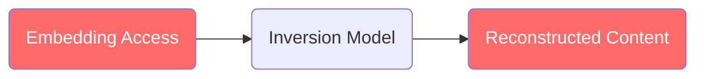

Vector embeddings are often treated as opaque numerical representations, but they are not. Modern machine learning techniques can **reconstruct the original content** from an embedding with high fidelity, making plaintext embeddings a direct data exposure risk.

<Warning>
Cyborg has [demonstrated](./threat-model#4-attack-demonstration) embedding inversion attacks achieving **99.38% content reconstruction** in under 5 minutes on a production-like vector database.
</Warning>

## 1. What Is Embedding Inversion?

Embedding models map input data (text, images, audio, or any other modality) into dense vector representations that capture semantic meaning. **Inversion** is the reverse process: given a vector, recover the content that produced it.

Researchers have demonstrated successful inversion across every major embedding modality. The techniques are well-documented in academic literature, publicly available, and increasingly effective:

- **Publicly available** and require no special expertise to run
- **Fast**: reconstructing a document takes only a few seconds
- **Accurate**: achieving 95-99%+ fidelity with the original content

This means that **anyone with access to your embeddings effectively has access to the original data**.

## 2. Inversion Across Modalities

Embedding inversion is not limited to a single data type. Researchers have demonstrated successful attacks across text, images, audio, and even genomic data.

### Text

Text embedding inversion is the most mature area of research. The landmark paper [Text Embeddings Reveal (Almost) As Much As Text](https://arxiv.org/abs/2310.06816) (Morris et al., EMNLP 2023) introduced [vec2text](https://github.com/jxmorris12/vec2text), an iterative hypothesis-and-correction approach that achieves **92% exact recovery** of 32-token inputs with a BLEU score of 97.3. The method successfully extracted full names from clinical note embeddings.

Subsequent work has expanded the threat:

- **[GEIA](https://arxiv.org/abs/2305.03010)** (Li et al., ACL 2023) uses a fine-tuned GPT-2 decoder to recover coherent sentences, including named entities, from sentence embeddings with only black-box model access.
- **[Transferable Embedding Inversion](https://arxiv.org/abs/2406.10280)** (Huang et al., ACL 2024) trains an inverter on a surrogate model and transfers it to attack a different victim model the attacker cannot query - recovering 98% of age and 99% of sex information from clinical text embeddings.
- **[Zero2Text](https://arxiv.org/abs/2602.01757)** (2026) requires no training at all, using LLM priors with dynamic ridge regression to invert even closed-source models like OpenAI's `text-embedding-3-small/large`. Standard defenses like differential privacy noise fail to stop it.
- **[Multilingual inversion](https://arxiv.org/abs/2401.12192)** (ACL 2024) extends the threat beyond English to cross-lingual attacks.

Earlier foundational work by [Song & Raghunathan (ACM CCS 2020)](https://arxiv.org/abs/2004.00053) first demonstrated systematic privacy leakage from embeddings, including authorship and stylometry information.

### Images

Image embedding inversion has progressed from blurry reconstructions to near-photographic fidelity:

- **Face recognition embeddings** are particularly vulnerable. [Diffusion-based attacks](https://arxiv.org/abs/2504.18015) (2025) achieve **98.55% attack accuracy** against ArcFace on the LFW dataset by using unconditional diffusion models as generative priors. Earlier work by [Fredrikson et al. (ACM CCS 2015)](https://dl.acm.org/doi/10.1145/2810103.2813677) showed that crowdworkers could identify individuals from reconstructed face images with 95% accuracy.
- **CLIP embeddings** encode far more than intended. [Kazemi et al. (NeurIPS 2024)](https://arxiv.org/abs/2403.02580) demonstrated that pure gradient-based optimization against CLIP embeddings - with no decoder or training required - can reveal semantic content including concept blending and biases inherited from training data.
- **Vision-language model features** can be inverted to recover image captions with up to 0.52 ROUGE-L scores and classification labels at 92.71% accuracy ([CapRecover, 2025](https://arxiv.org/html/2507.22828v2)).

### Audio and Speech

Speaker embeddings carry enough information to reconstruct recognizable voice characteristics:

- Voice style transfer techniques can [reconstruct speech from stolen speaker embeddings](https://ieeexplore.ieee.org/document/9648375/) that is convincing enough to spoof automatic speaker verification systems (IEEE 2021).
- [Score-based impersonation attacks](https://arxiv.org/html/2603.02781v1) (2026) achieve a 91.65% success rate using only 50 queries to the target system.
- Even [voice anonymization systems](https://www.researchgate.net/publication/355223468_On_the_invertibility_of_a_voice_privacy_system_using_embedding_alignement) can be inverted, recovering up to 62% of original speaker identities.

### Other Modalities

The threat extends beyond the modalities above:

- **DNA sequences**: [Ouaari et al. (2026)](https://arxiv.org/abs/2603.06950) achieved 99.8% nucleotide accuracy and 79.5% exact sequence matches when inverting genomic foundation model embeddings from models like Evo 2.
- **Graph data**: Inference attacks can [extract private node and edge attributes](https://arxiv.org/pdf/2008.13072) from graph neural network embeddings, relevant to social networks and knowledge graphs.

## 3. Why It Matters

The academic results above are not theoretical. The inversion tools are open-source and the techniques are reproducible. Organizations adopting RAG and other AI architectures centralize sensitive data from across multiple systems - HR records, financial data, medical information, legal documents - into a single vector database. If that database stores embeddings in plaintext, a single breach exposes intelligence from every connected system.

### Real-World Attack Results

Testing against standard (unencrypted) vector databases demonstrates the severity:

| Embedding Storage | Reconstruction Rate | Avg. Similarity |
|-------------------|---------------------|-----------------|
| **Plaintext** (standard vector DBs) | 95-100% high-similarity reconstructions | >95% |
| **Encrypted** (CyborgDB) | **0%** successful reconstructions | **0.0%** |

Against unencrypted databases, inversion models routinely achieve near-exact reconstruction of the original content. Against CyborgDB's encrypted embeddings, the same models produce only empty results: the attack is completely ineffective.

<Info>
You can reproduce these results yourself using the [vectordb-inversion-demo](https://github.com/cyborginc/vectordb-inversion-demo) repository, which demonstrates embedding extraction and inversion against several popular vector databases and shows how CyborgDB's encryption prevents the attack entirely.
</Info>

## 4. Attack Vectors

Embedding inversion requires two steps: **extraction** and **inversion**. The inversion tooling is freely available - the attacker's only challenge is getting access to the raw embeddings. In practice, there are many ways this can happen.

### Storage-Level Extraction

Most vector databases store embeddings as plaintext on disk - whether in database tables, flat files, or memory-mapped segments. These are accessible to anyone with file system access to the database storage, including cloud administrators, container escape exploits, or compromised backup systems. **This works even if the database is stopped or password-protected.**

### Memory-Level Extraction

Embeddings in process memory can be dumped via `ptrace` system calls, core dumps, or direct reads of `/proc/{PID}/mem` on Linux. This is especially relevant in containerized environments where debugging capabilities may be enabled, and **completely bypasses** all authentication, network access controls, and application-level security.

### API and Credential Compromise

Leaked or stolen API keys, database connection strings, or cloud credentials give attackers direct query access to the vector database - no file system exploit required. This includes:

- **Leaked API keys**: Credentials accidentally committed to version control, exposed in logs, or stolen via phishing
- **Compromised cloud credentials**: IAM roles, service account keys, or SSO tokens that grant access to managed database services
- **Overly permissive access policies**: Database instances exposed to the public internet or accessible across network boundaries without proper segmentation

With query access, an attacker can simply read embeddings through the database's own API, making storage-level protections irrelevant.

### Backup and Snapshot Exposure

Database backups, cloud snapshots, and disaster recovery replicas often contain full copies of the embedding data. These are frequently stored with weaker access controls than the production database and may persist long after the original data has been rotated or deleted.

### Supply Chain and Insider Access

Cloud providers, managed database operators, and third-party infrastructure vendors may have access to the underlying storage or compute environment. A compromised or malicious insider at any layer of the stack can extract embeddings without triggering application-level monitoring.

### The Common Thread

All of these vectors share the same fundamental problem: if the embeddings are stored or processed in plaintext at any point, they are vulnerable to extraction and inversion. This is why [encryption in use](./encryption) - not just encryption at rest or in transit - is essential to mitigating the inversion threat.

## 5. Limitations of Common Security Measures

While important as part of a defense-in-depth strategy, several common security measures **do not directly address** the embedding inversion threat:

<CardGroup cols={2}>
  <Card title="Network Access Controls" icon="shield-halved">
    Important for perimeter security, but do not protect against file system or memory-level extraction
  </Card>
  <Card title="Database Authentication" icon="key">
    Controls who can query the database, but does not encrypt the underlying storage
  </Card>
  <Card title="TLS / Encryption in Transit" icon="lock">
    Protects data between client and server, but not data at rest or in use
  </Card>
  <Card title="Application-Layer Auth" icon="user-lock">
    Governs application access, but does not prevent direct storage-level reads
  </Card>
</CardGroup>

These controls remain valuable - but as long as **the embeddings themselves are stored in plaintext**, the inversion risk persists.

## 6. How CyborgDB Prevents Inversion

CyborgDB eliminates the inversion attack surface by ensuring embeddings are **never stored or processed in plaintext**:

- **Encryption at rest**: All embeddings are encrypted with AES-256-GCM before being written to the backing store
- **Encryption in use**: Embeddings remain encrypted during search and computation
- **Per-record key isolation**: Each record uses a unique initialization vector, preventing cross-record correlation
- **Customer key control**: Encryption keys are managed by the customer, not the database operator

Because the backing store only ever contains ciphertext, an attacker who gains full access to the database - whether through file system access, memory dumps, or compromised infrastructure - obtains only encrypted data that is computationally infeasible to invert.

<Tip>
For full details on CyborgDB's cryptographic implementation, see the [Encryption](./encryption) guide.
</Tip>

## 7. Further Reading

<CardGroup cols={2}>
    <Card title="Security Overview" href="./security-overview" icon="shield">
        CyborgDB's defense-in-depth security architecture
    </Card>
    <Card title="Threat Model" href="./threat-model" icon="bomb">
        Adversary model, attack surfaces, and mitigation mapping
    </Card>
</CardGroup>
